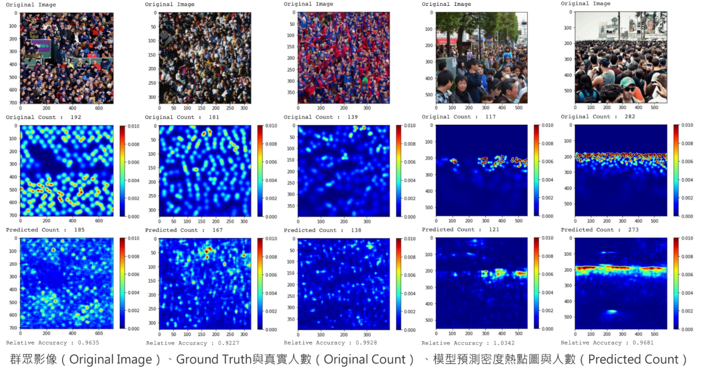
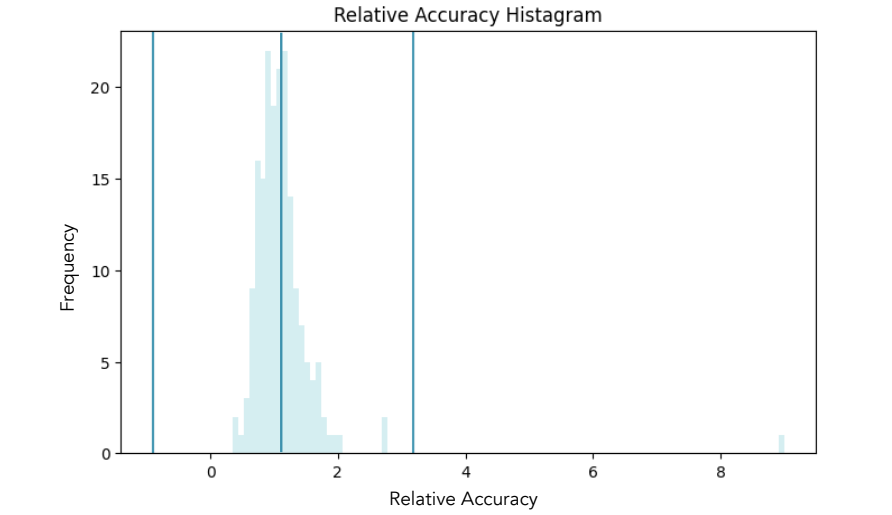

# CSRNet_Crowd_Counting_Using_Pytorch

▌Introduction

Crowd Counting is a CV & DL technique to estimate the number of people in crowded scenes. By the CSRNet with ShanghaiTech dataset for image/video analysis in public places. The front end of model uses a convolutional network for 2D feature extraction, while the back end uses Dilated Convolutional Layers to eliminate redundant model structures, and achieve good results with Knowledge Distillation.

▌Results

     
 
  * Predicted Crowd Counting and Density Map
  
    

  * Relative Accuracy
